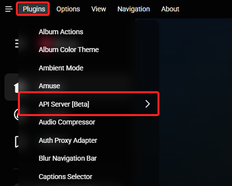
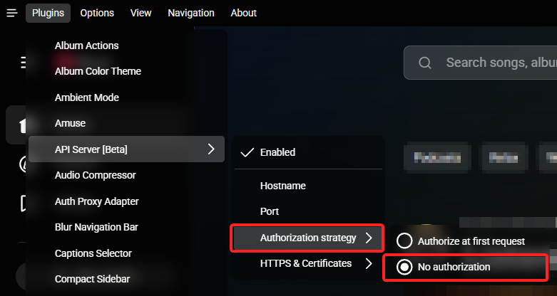

## Pear Desktop

A Module to Interface with Pear Desktop (https://github.com/pear-devs/pear-desktop)

### Configuration

- Open the 'Plugins' Menu in the top left Corner and enable the 'API Server [Beta]' plugin

  

- Open the settings for the plugin and select 'No authorization' for the 'Authorization strategy' - This will change as soon as the API supports websocket auth

  

## Available actions

- playPause (Toggle play/pause state of the player)
- play (Play)
- pause (Pause)
- volumeUp (Increase the volume of the player)
- volumeDown (Decrease the volume of the player)
- setVolume (Set the volume of the player)
- seekTo (Seek to a specific position in the currently playing track)
- next (Skip to the next track)
- previous (Go back to the previous track)
- repeatMode (Set the repeat mode of the player)
- shuffle (Enable/disable shuffle mode)
- toggleLike (Toggle the like state of the currently playing track (note: this does not toggle like/dislike, it just toggles like/unlike))
- toggleDislike (Toggle the dislike state of the currently playing track (note: this does not toggle like/dislike, it just toggles dislike/undislike))

## Available feedbacks

- AlbumCover (Sets the PNG to the album cover of the currently playing track)

## Available variables

- title (Title of the currently playing track)
- artist (Artist of the currently playing track)
- volumePercent (Volume of the player (1-100%))
- duration (Duration of the currently playing track (seconds))
- duration_formatted (Duration of the currently playing track)
- trackProgress (Video progress of the player (seconds))
- trackProgress_formatted (Video progress of the player)
- trackState (State of the player (unknown, paused, playing))
- videoId (Video ID of the currently playing track)
- albumCover (Image source URL of the currently playing track)
